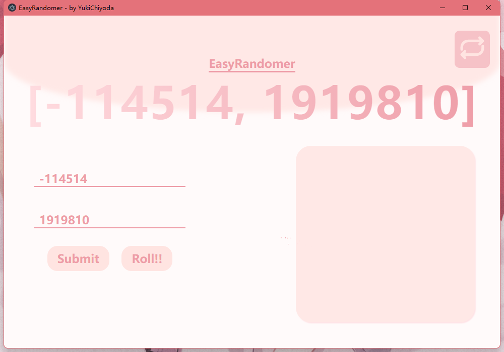
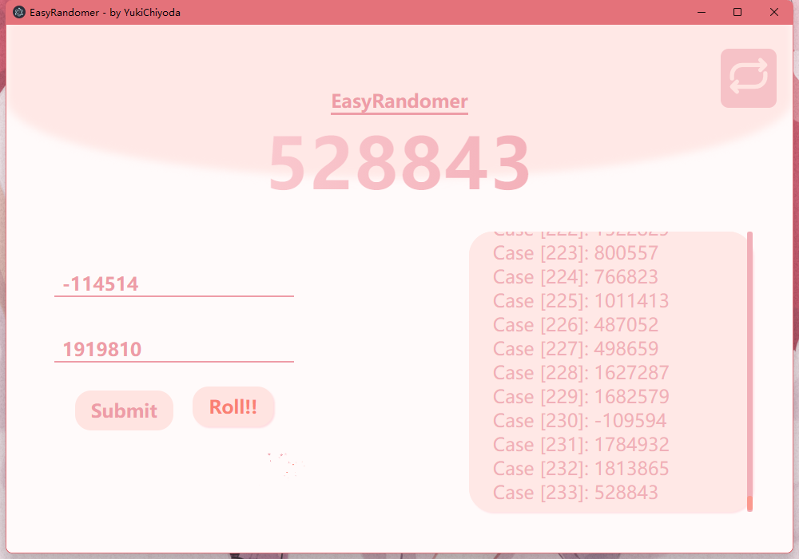

# EasyRandomer
### Make it easy for you to produce a range of random numbers.
---
## Get Started
* Download the latest release package.
* Install and run "EasyRandomer.exe".
* Type in the range of random numbers in the input boxes.
    (The random range will include **both head and tail**)
* Click the button "Submit" and you will see the full range in the tital line.
    (**Tip:** After the first click, press the "ENTER" key to easily create the following numbers)
* Click the button "Roll!" and you will get a random number in the tital line.
    (The history can be seen in the right list)
* Click the buttom "Submit" again to start a new process.
## Repeatable Random Numbers?
* **Method:**
    Decide whether the next number will be repeatable or not by activating the button in the right top.
    You can activate this button in any time you like.
* **Example:**
     This means the next number **IS NOT** repeatable.
     This means the next number **IS** repeatable.
* **Warning:**
    When the number is repeatable, the index number in the history will not work.
---
## Others
* **Algorithm:** Normal hash list
* **Frame:** Electron, Vue.JS
* **Language:** HTML, CSS, JavaScript
* **Window Size:** 1000 * 700 (Resizable)
---
## Screenshots Preview
### Beginning

### Submitting

### Results
